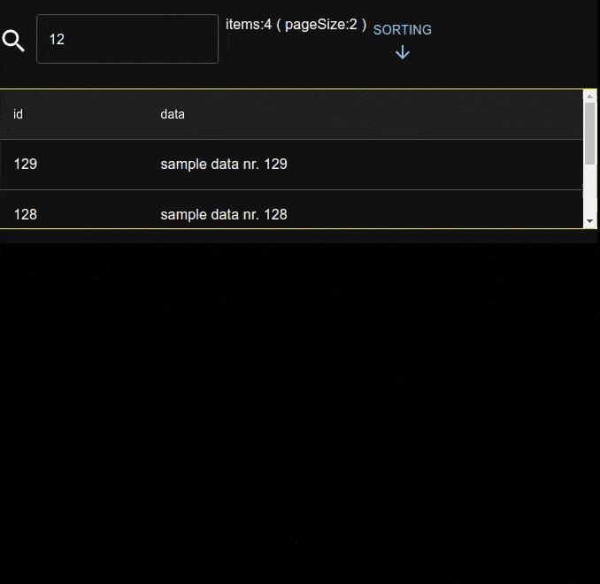

# example infinite scroll



## features

- load filtered rows on demand for resize occurred or scrolled to the end
- fixed header can be managed by placing infinite scroll with a top margin
- count of rows to load in order to fill the page are computed by a generic customizable row height
- feedbacks for pagesize, items, loading in progress, available height changed
- resize window feed more data if needed in a debounced way
- sort and filter model applicable and usable in the fetchData method

## quickstart

```sh
cd example-infinite-scroll/example-app
npm run dev
```

to debug from vscode hit F5

## how this project was built

```sh
mkdir example-infinite-scroll
cd example-infinite-scroll
npm create vite@latest example-app -- --template react-ts
cd example-app
npm i

npm install @mui/material @emotion/react @emotion/styled
# added peer dependencies ( https://mui.com/material-ui/getting-started/installation/ )
npm install @mui/icons-material @mui/material
npm i linq-to-typescript usehooks-ts
```